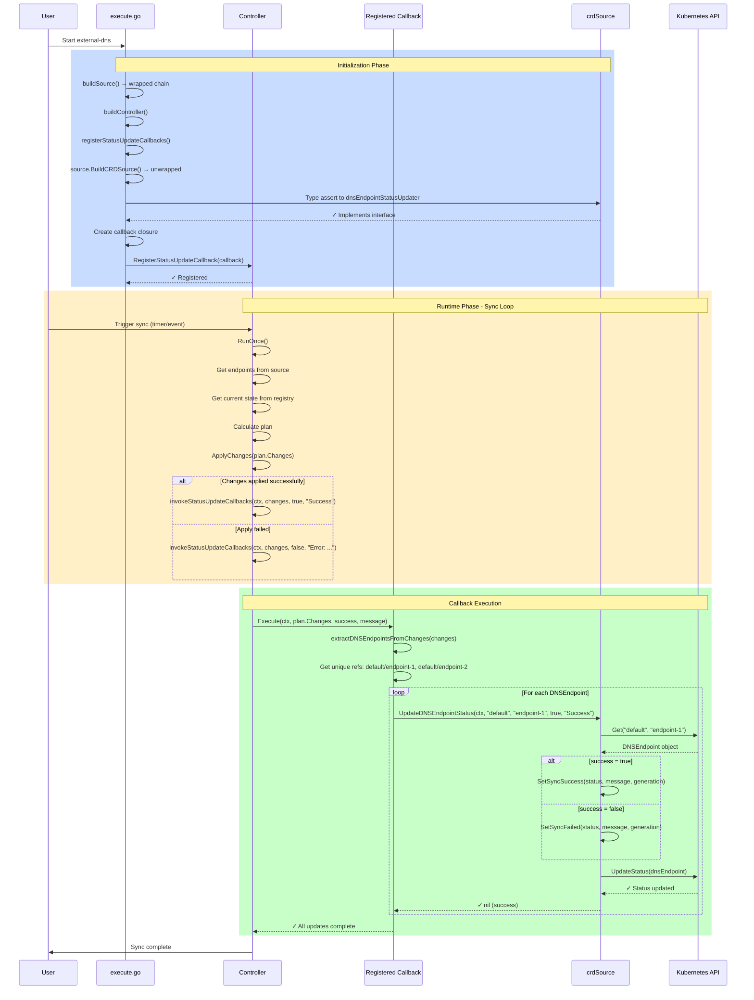

# Callback-Based DNSEndpoint Status Update Implementation

## Overview

This document describes the callback-based implementation for updating DNSEndpoint CRD status fields after DNS synchronization. This approach was chosen to solve the source wrapper chain issue where type assertions fail because `c.Source` is wrapped in multiple layers (PostProcessor → TargetFilterSource → NAT64Source → DedupSource → MultiSource → crdSource).

## Problem Statement

The original implementation used type assertion `c.Source.(dnsEndpointStatusUpdater)` which always failed because:

1. Sources are wrapped in multiple wrapper layers during initialization
2. Wrappers don't implement the `dnsEndpointStatusUpdater` interface
3. Controller only has access to the outermost wrapper (PostProcessor)
4. Type assertion cannot reach the underlying crdSource

## Solution Architecture

### Callback Registration Pattern

Instead of type assertions, use callback registration:

1. Controller exposes `RegisterStatusUpdateCallback()` method
2. During initialization, create a separate unwrapped crdSource instance
3. Register a callback function that processes plan changes and updates status
4. Controller invokes all registered callbacks after DNS sync completion

### Separation of Concerns

- **Controller Layer**: Knows about plan.Changes, orchestrates batch processing
- **Source Layer**: Simple CRUD operations on individual DNSEndpoints, no plan knowledge

## Diagrams

### Flowchart: Initialization and Runtime Flow

```mermaid
flowchart TD
    Start([Execute Starts]) --> BuildSource[Build Wrapped Source Chain]
    BuildSource --> BuildController[Build Controller]
    BuildController --> CheckCRD{CRD in sources?}

    CheckCRD -->|No| Skip[Skip callback registration]
    CheckCRD -->|Yes| RegisterCB[registerStatusUpdateCallbacks]

    RegisterCB --> CreateCRD[Create separate unwrapped crdSource]
    CreateCRD --> TypeAssert{Type assert to<br/>dnsEndpointStatusUpdater?}

    TypeAssert -->|Failed| Warn[Log warning]
    TypeAssert -->|Success| CreateCallback[Create callback closure]

    CreateCallback --> RegisterCallback[ctrl.RegisterStatusUpdateCallback]
    RegisterCallback --> LogSuccess[Log: Callback registered]

    Skip --> RunController[Controller Run Loop]
    Warn --> RunController
    LogSuccess --> RunController

    RunController --> RunOnce[RunOnce called]
    RunOnce --> GetEndpoints[Get endpoints from source]
    GetEndpoints --> GetRegistry[Get current state from registry]
    GetRegistry --> CalcPlan[Calculate plan]
    CalcPlan --> HasChanges{plan.Changes.HasChanges?}

    HasChanges -->|No| NoChanges[Log: No changes]
    HasChanges -->|Yes| ApplyChanges[Registry.ApplyChanges]

    ApplyChanges --> CheckError{Error?}
    CheckError -->|Yes| InvokeFail[invokeStatusUpdateCallbacks<br/>success=false]
    CheckError -->|No| InvokeSuccess[invokeStatusUpdateCallbacks<br/>success=true]

    InvokeFail --> CallbackLoop{For each callback}
    InvokeSuccess --> CallbackLoop

    CallbackLoop --> ExtractRefs[extractDNSEndpointsFromChanges]
    ExtractRefs --> UpdateLoop{For each DNSEndpoint}

    UpdateLoop --> UpdateStatus[crdSource.UpdateDNSEndpointStatus<br/>namespace, name, success, message]
    UpdateStatus --> GetCRD[Get DNSEndpoint CRD]
    GetCRD --> SetStatus{success?}

    SetStatus -->|Yes| SetSuccess[SetSyncSuccess]
    SetStatus -->|No| SetFail[SetSyncFailed]

    SetSuccess --> UpdateCRD[UpdateStatus to API server]
    SetFail --> UpdateCRD

    UpdateCRD --> MoreEndpoints{More endpoints?}
    MoreEndpoints -->|Yes| UpdateLoop
    MoreEndpoints -->|No| MoreCallbacks{More callbacks?}

    MoreCallbacks -->|Yes| CallbackLoop
    MoreCallbacks -->|No| Complete[Sync complete]

    NoChanges --> Complete
    Complete --> RunOnce

    style Start fill:#90EE90
    style Complete fill:#90EE90
    style CheckError fill:#FFB6C1
    style TypeAssert fill:#FFD700
    style HasChanges fill:#FFD700
```



### Sequence Diagram: Status Update Flow



## Files Changed

### 1. controller/controller.go

**Purpose**: Add callback infrastructure to Controller

**Changes**:

```go
// Added before Controller struct
type StatusUpdateCallback func(ctx context.Context, changes *plan.Changes, success bool, message string)

// Added to Controller struct
type Controller struct {
    // ... existing fields ...
    UpdateDNSEndpointStatus bool
    statusUpdateCallbacks   []StatusUpdateCallback
    statusUpdateMutex       sync.RWMutex
}

// Added methods at end of file
func (c *Controller) RegisterStatusUpdateCallback(callback StatusUpdateCallback)
func (c *Controller) invokeStatusUpdateCallbacks(ctx context.Context, changes *plan.Changes, success bool, message string)
```

**Modified in RunOnce() method** (around line 255-283):

- Replaced `c.updateDNSEndpointStatus()` calls with `c.invokeStatusUpdateCallbacks()`
- Added `if c.UpdateDNSEndpointStatus` check before invoking callbacks
- Invoke on both success and failure paths

### 2. source/crd.go

**Purpose**: Add simple status update method for individual DNSEndpoints

**Changes**:

```go
// Removed import
- "sigs.k8s.io/external-dns/plan"

// Added method at end of file
func (cs *crdSource) UpdateDNSEndpointStatus(ctx context.Context, namespace, name string, success bool, message string) error {
    dnsEndpoint, err := cs.Get(ctx, namespace, name)
    if err != nil {
        return fmt.Errorf("failed to get DNSEndpoint: %w", err)
    }

    if success {
        apiv1alpha1.SetSyncSuccess(&dnsEndpoint.Status, message, dnsEndpoint.Generation)
    } else {
        apiv1alpha1.SetSyncFailed(&dnsEndpoint.Status, message, dnsEndpoint.Generation)
    }

    _, err = cs.UpdateStatus(ctx, dnsEndpoint)
    if err != nil {
        return fmt.Errorf("failed to update status: %w", err)
    }

    log.Debugf("Updated status of DNSEndpoint %s/%s: success=%v", namespace, name, success)
    return nil
}
```

**Key Design**:

- Method updates ONE endpoint at a time
- No knowledge of plan.Changes
- Returns error for proper error handling

### 3. source/store.go

**Purpose**: Export buildCRDSource function for callback registration

**Changes**:

```go
// Added after buildCRDSource function (around line 567)
// BuildCRDSource creates a CRD source for exposing custom resources as DNS records.
// Exported for use in status update callback registration.
func BuildCRDSource(ctx context.Context, p ClientGenerator, cfg *Config) (Source, error) {
    return buildCRDSource(ctx, p, cfg)
}
```

### 4. controller/execute.go

**Purpose**: Register status update callback during initialization

**Changes**:

**In Execute() function** (after line 137):

```go
// Register status update callbacks for CRD sources
if slices.Contains(cfg.Sources, "crd") {
    registerStatusUpdateCallbacks(ctx, ctrl, cfg)
}
```

**Added functions at end of file** (before configureLogger):

```go
// registerStatusUpdateCallbacks creates a CRD source instance and registers its status update callback
func registerStatusUpdateCallbacks(ctx context.Context, ctrl *Controller, cfg *externaldns.Config) {
    sourceCfg := source.NewSourceConfig(cfg)

    crdSource, err := source.BuildCRDSource(ctx, &source.SingletonClientGenerator{
        KubeConfig:     cfg.KubeConfig,
        APIServerURL:   cfg.APIServerURL,
        RequestTimeout: cfg.RequestTimeout,
    }, sourceCfg)

    if err != nil {
        log.Warnf("Could not create CRD source for status updates: %v", err)
        return
    }

    // Type assert to access the UpdateDNSEndpointStatus method
    type dnsEndpointStatusUpdater interface {
        UpdateDNSEndpointStatus(ctx context.Context, namespace, name string, success bool, message string) error
    }

    crdSrc, ok := crdSource.(dnsEndpointStatusUpdater)
    if !ok {
        log.Warn("CRD source does not implement UpdateDNSEndpointStatus method")
        return
    }

    // Register a callback that processes all changes and updates each DNSEndpoint
    callback := func(ctx context.Context, changes *plan.Changes, success bool, message string) {
        // Collect unique DNSEndpoint references from all changes
        dnsEndpoints := extractDNSEndpointsFromChanges(changes)

        log.Debugf("Updating status for %d DNSEndpoint(s)", len(dnsEndpoints))

        // Update status for each unique DNSEndpoint
        for key, ref := range dnsEndpoints {
            err := crdSrc.UpdateDNSEndpointStatus(ctx, ref.namespace, ref.name, success, message)
            if err != nil {
                log.Warnf("Failed to update status for DNSEndpoint %s: %v", key, err)
            }
        }
    }

    ctrl.RegisterStatusUpdateCallback(callback)
    log.Info("Registered DNSEndpoint status update callback")
}

// dnsEndpointRef holds a reference to a DNSEndpoint CRD
type dnsEndpointRef struct {
    namespace string
    name      string
}

// extractDNSEndpointsFromChanges extracts unique DNSEndpoint references from plan changes
func extractDNSEndpointsFromChanges(changes *plan.Changes) map[string]dnsEndpointRef {
    endpoints := make(map[string]dnsEndpointRef)

    // Helper to add endpoint ref
    addEndpoint := func(ep *endpoint.Endpoint) {
        if ep == nil {
            return
        }
        ref := ep.RefObject()
        if ref == nil || ref.Kind != "DNSEndpoint" {
            return
        }
        key := fmt.Sprintf("%s/%s", ref.Namespace, ref.Name)
        if _, exists := endpoints[key]; !exists {
            endpoints[key] = dnsEndpointRef{
                namespace: ref.Namespace,
                name:      ref.Name,
            }
        }
    }

    // Collect from all change types
    for _, ep := range changes.Create {
        addEndpoint(ep)
    }
    for _, ep := range changes.UpdateOld {
        addEndpoint(ep)
    }
    for _, ep := range changes.UpdateNew {
        addEndpoint(ep)
    }
    for _, ep := range changes.Delete {
        addEndpoint(ep)
    }

    return endpoints
}
```

### 5. controller/dnsendpoint_status.go

**Purpose**: Remove old implementation

**Changes**: Replaced entire file content with deprecation notice:

```go
package controller

// This file previously contained the dnsEndpointStatusUpdater interface and updateDNSEndpointStatus method.
//
// The status update mechanism has been replaced with a callback-based approach:
// - Controller now has RegisterStatusUpdateCallback() method
// - CRD source implements UpdateDNSEndpointStatus() method
// - Callbacks are registered during initialization in controller/execute.go
// - Controller invokes callbacks after sync completion in RunOnce()
//
// This avoids the source wrapper chain issue where type assertions would fail because
// c.Source is wrapped in PostProcessor, TargetFilterSource, etc.
```

### 6. controller/dnsendpoint_status_test.go

**Purpose**: Update tests for new callback mechanism

**Changes**: Replaced old tests with new ones:

```go
func TestCallbackRegistration(t *testing.T)
func TestMultipleCallbacks(t *testing.T)
```

Tests verify:

- Callbacks can be registered
- Callbacks are invoked with correct parameters
- Multiple callbacks all execute

## Implementation Flow

### Initialization (Execute())

```
1. Build wrapped source chain
2. Build controller
3. Check if "crd" in sources list
4. Call registerStatusUpdateCallbacks()
   a. Create separate unwrapped crdSource instance
   b. Type assert to dnsEndpointStatusUpdater interface
   c. Create callback closure that:
      - Extracts DNSEndpoint refs from plan.Changes
      - Calls crdSrc.UpdateDNSEndpointStatus() for each
   d. Register callback with controller
```

### Runtime (RunOnce())

```
1. Get endpoints from source
2. Get current state from registry
3. Calculate plan
4. Apply changes to DNS provider
5. If UpdateDNSEndpointStatus enabled:
   a. Call controller.invokeStatusUpdateCallbacks()
   b. For each registered callback:
      - Pass (ctx, plan.Changes, success, message)
6. Callback executes:
   a. Extract unique DNSEndpoint refs from changes
   b. For each DNSEndpoint:
      - Call crdSource.UpdateDNSEndpointStatus()
      - Update status (SetSyncSuccess/SetSyncFailed)
      - UpdateStatus() to API server
```

## Key Design Decisions

### 1. Separate CRD Source Instance

**Decision**: Create a new crdSource instance for status updates instead of trying to unwrap the main source

**Rationale**:

- Avoids complex unwrapping logic
- Clean separation of concerns
- Minimal overhead (shares same Kubernetes client)
- Main source remains unchanged

### 2. Batch Processing in Controller Layer

**Decision**: Keep batch processing logic in controller/execute.go, not in crdSource

**Rationale**:

- crdSource shouldn't know about plan.Changes structure
- Single Responsibility: crdSource = CRD operations only
- Controller layer = orchestration logic
- Better testability and separation

### 3. Simple Method Signature

**Decision**: `UpdateDNSEndpointStatus(ctx, namespace, name, success, message) error`

**Rationale**:

- One endpoint at a time
- No coupling to plan internals
- Returns error for proper error handling
- Reusable from anywhere
- Easy to test

### 4. Callback Pattern

**Decision**: Use function callbacks instead of interfaces

**Rationale**:

- No need to modify wrappers
- Flexible - any function matching signature can be registered
- Extensible - multiple callbacks supported
- Clean separation from main source chain

## Benefits

1. **No Wrapper Modifications**: Wrappers remain unchanged
2. **Clean Separation**: Source layer independent of plan structure
3. **Type Safety**: Compile-time checking of callback signature
4. **Extensible**: Easy to add more callbacks for other sources
5. **Testable**: Simple methods easy to unit test
6. **Maintainable**: Clear separation of concerns

## Trade-offs

1. **Separate Instance**: Creates second crdSource instance (minimal overhead)
2. **Initialization Complexity**: Requires wiring in Execute() function
3. **Async Nature**: Status updates happen after controller moves on (acceptable for status)

## Testing

All tests pass:

- `controller/controller_test.go` - Controller functionality
- `controller/dnsendpoint_status_test.go` - Callback registration
- `source/crd_test.go` - CRD source operations

## Related Files

- `dnsendpoint-status-investigation.md` - Original investigation and problem analysis
- `apis/v1alpha1/dnsendpoint.go` - DNSEndpoint CRD definition with status fields
- `apis/v1alpha1/status_helpers.go` - Status helper functions (SetSyncSuccess, SetSyncFailed)
