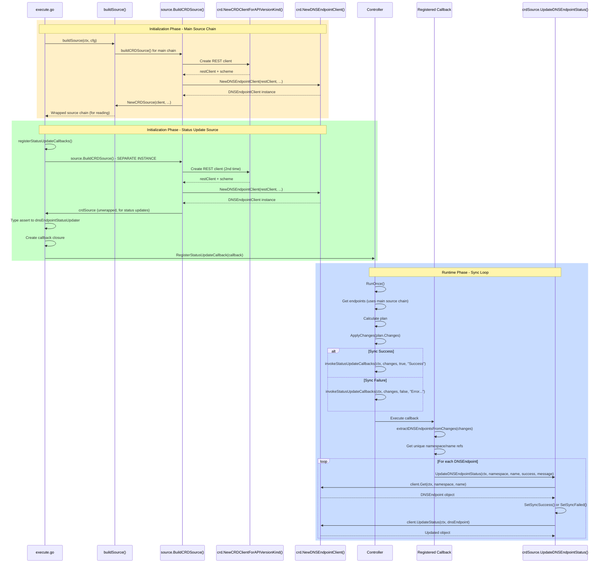

# Controller CRD Update Flow Analysis

## Current Architecture Overview

The current implementation creates **two separate CRD source instances**:

1. **Main Source Chain** - Used for reading DNSEndpoint CRDs and generating endpoints
2. **Status Update Source** - Used only for updating DNSEndpoint status after sync

## Flow Diagram



## Component Breakdown

### 1. execute.go - Initialization

**Location**: `controller/execute.go:100-142`

```go
func Execute() {
    // Line 112: Build main source chain (wrapped)
    endpointsSource, err := buildSource(ctx, cfg)

    // Line 134: Build controller with main source
    ctrl, err := buildController(ctx, cfg, endpointsSource, prvdr, domainFilter)

    // Lines 140-142: Register status update callbacks
    if slices.Contains(cfg.Sources, "crd") {
        registerStatusUpdateCallbacks(ctx, ctrl, cfg)
    }
}
```

### 2. registerStatusUpdateCallbacks() - Callback Setup

**Location**: `controller/execute.go:408-452`

```go
func registerStatusUpdateCallbacks(ctx context.Context, ctrl *Controller, cfg *externaldns.Config) {
    sourceCfg := source.NewSourceConfig(cfg)

    // CREATE SEPARATE CRD SOURCE INSTANCE
    // This is the 2nd instance, independent from main source chain
    crdSource, err := source.BuildCRDSource(ctx, &source.SingletonClientGenerator{
        KubeConfig:     cfg.KubeConfig,
        APIServerURL:   cfg.APIServerURL,
        RequestTimeout: cfg.RequestTimeout,
    }, sourceCfg)

    // Type assert to access UpdateDNSEndpointStatus method
    type dnsEndpointStatusUpdater interface {
        UpdateDNSEndpointStatus(ctx context.Context, namespace, name string, success bool, message string) error
    }

    crdSrc, ok := crdSource.(dnsEndpointStatusUpdater)

    // Create callback closure that captures crdSrc
    callback := func(ctx context.Context, changes *plan.Changes, success bool, message string) {
        dnsEndpoints := extractDNSEndpointsFromChanges(changes)

        // Update status for each unique DNSEndpoint using the SEPARATE instance
        for key, ref := range dnsEndpoints {
            err := crdSrc.UpdateDNSEndpointStatus(ctx, ref.namespace, ref.name, success, message)
            if err != nil {
                log.Warnf("Failed to update status for DNSEndpoint %s: %v", key, err)
            }
        }
    }

    ctrl.RegisterStatusUpdateCallback(callback)
}
```

### 3. source.BuildCRDSource() - Factory Method

**Location**: `source/store.go:556-591`

```go
func buildCRDSource(ctx context.Context, p ClientGenerator, cfg *Config) (Source, error) {
    kubeClient, err := p.KubeClient()

    // Create REST client for CRD access
    restClient, _, err := crd.NewCRDClientForAPIVersionKind(
        kubeClient, cfg.KubeConfig, cfg.APIServerURL,
        cfg.CRDSourceAPIVersion, cfg.CRDSourceKind,
    )

    // Create DNSEndpoint client (Repository layer)
    dnsEndpointClient := crd.NewDNSEndpointClient(
        restClient,
        cfg.Namespace,
        cfg.CRDSourceKind,
        metav1.ParameterCodec,
    )

    // Create CRD source with UpdateEvents controlling informer startup
    return NewCRDSource(
        dnsEndpointClient,
        cfg.AnnotationFilter,
        cfg.LabelFilter,
        cfg.UpdateEvents,
    )
}
```

### 4. DNSEndpointClient Creation

**Location**: `pkg/crd/dnsendpoint_client.go:61-68`

```go
func NewDNSEndpointClient(restClient rest.Interface, namespace, kind string, codec runtime.ParameterCodec) DNSEndpointClient {
    return &dnsEndpointClient{
        restClient: restClient,     // REST client to K8s API
        namespace:  namespace,      // Target namespace
        resource:   strings.ToLower(kind) + "s", // "dnsendpoints"
        codec:      codec,          // metav1.ParameterCodec
    }
}
```

### 5. crdSource.UpdateDNSEndpointStatus() - Status Update Method

**Location**: `source/crd.go:174-195`

```go
func (cs *crdSource) UpdateDNSEndpointStatus(ctx context.Context, namespace, name string, success bool, message string) error {
    // 1. Get current DNSEndpoint
    dnsEndpoint, err := cs.client.Get(ctx, namespace, name)
    if err != nil {
        return fmt.Errorf("failed to get DNSEndpoint: %w", err)
    }

    // 2. Update status conditions based on success/failure
    if success {
        apiv1alpha1.SetSyncSuccess(&dnsEndpoint.Status, message, dnsEndpoint.Generation)
    } else {
        apiv1alpha1.SetSyncFailed(&dnsEndpoint.Status, message, dnsEndpoint.Generation)
    }

    // 3. Update status subresource via API
    _, err = cs.client.UpdateStatus(ctx, dnsEndpoint)
    if err != nil {
        return fmt.Errorf("failed to update status: %w", err)
    }

    log.Debugf("Updated status of DNSEndpoint %s/%s: success=%v", namespace, name, success)
    return nil
}
```

### 6. Controller Invocation Points

**Location**: `controller/controller.go:258-273`

```go
// In RunOnce() method, after ApplyChanges()

if err := c.Registry.ApplyChanges(ctx, plan.Changes); err != nil {
    // ON FAILURE: Invoke callbacks with error message
    if c.UpdateDNSEndpointStatus {
        c.invokeStatusUpdateCallbacks(ctx, plan.Changes, false, fmt.Sprintf("Failed to sync: %v", err))
    }
    return err
} else {
    emitChangeEvent(c.EventEmitter, *plan.Changes, events.RecordReady)

    // ON SUCCESS: Invoke callbacks with success message
    if c.UpdateDNSEndpointStatus {
        c.invokeStatusUpdateCallbacks(ctx, plan.Changes, true, "Successfully synced DNS records")
    }
}
```

## Key Observations

### 1. **Dual Instance Architecture**

**Problem**: Two separate `crdSource` instances are created:

- **Instance #1**: Main source chain (wrapped in PostProcessor, filters, etc.)
  - Created in `buildSource()` at line 112
  - Used for **reading** DNSEndpoint CRDs and generating endpoints
  - Has informer running if `UpdateEvents` is enabled

- **Instance #2**: Status update source (unwrapped, standalone)
  - Created in `registerStatusUpdateCallbacks()` at line 412
  - Used **only** for **updating** status after sync
  - Separate DNSEndpointClient, separate REST client

**Why Two Instances?**
The documentation (`callback-status-update-implementation.md:431-438`) explains:

> **Decision**: Create a new crdSource instance for status updates instead of trying to unwrap the main source
>
> **Rationale**:
>
> - Avoids complex unwrapping logic
> - Clean separation of concerns
> - Minimal overhead (shares same Kubernetes client)
> - Main source remains unchanged

### 2. **DNSEndpointClient Passing**

DNSEndpointClient is **not directly passed** from execute.go. Instead:

1. `execute.go` calls `source.BuildCRDSource()` factory method
2. Factory creates `crd.NewCRDClientForAPIVersionKind()` → REST client
3. Factory creates `crd.NewDNSEndpointClient(restClient, ...)` → DNSEndpointClient
4. Factory passes DNSEndpointClient to `NewCRDSource(client, ...)`
5. crdSource stores it in `cs.client` field

**Flow**:

```
execute.go
  └─> source.BuildCRDSource()
       └─> crd.NewCRDClientForAPIVersionKind()  [creates REST client]
       └─> crd.NewDNSEndpointClient()           [wraps REST client]
       └─> source.NewCRDSource(client, ...)      [receives client]
            └─> crdSource.client = client        [stores for later use]
```

### 3. **Status Update Process**

**Full Flow**:

```
1. Controller.RunOnce()
   ↓
2. Get endpoints from source chain (Instance #1)
   ↓
3. Calculate plan.Changes
   ↓
4. Registry.ApplyChanges(plan.Changes)
   ↓
5. Controller.invokeStatusUpdateCallbacks(ctx, changes, success, message)
   ↓
6. For each registered callback:
   ├─> Extract DNSEndpoint refs from changes
   └─> For each ref:
       ├─> crdSource.UpdateDNSEndpointStatus(namespace, name, success, message) [Instance #2]
       │   ├─> cs.client.Get(ctx, namespace, name)
       │   ├─> SetSyncSuccess() or SetSyncFailed()
       │   └─> cs.client.UpdateStatus(ctx, dnsEndpoint)
       └─> Update complete
```

### 4. **No Direct Dependency Between Instances**

- **Main source** (Instance #1) doesn't know about status updates
- **Status update source** (Instance #2) doesn't know about the main source chain
- They communicate indirectly through:
  - Controller passing `plan.Changes` to callbacks
  - Callbacks extracting DNSEndpoint refs from endpoint metadata (`ep.RefObject()`)
  - Status update source fetching CRDs by namespace/name

### 5. **Layer Separation**

The architecture maintains clean layers:

```
Controller Layer (execute.go, controller.go)
  ├─ Orchestrates sync loop
  ├─ Manages callbacks
  └─ Extracts DNSEndpoint refs from plan.Changes
      ↓
Source Layer (source/crd.go)
  ├─ Business logic (filtering, validation, labeling)
  ├─ UpdateDNSEndpointStatus() method (single endpoint)
  └─ Uses DNSEndpointClient interface
      ↓
Repository Layer (pkg/crd/dnsendpoint_client.go)
  ├─ Pure CRUD operations
  ├─ Get(), List(), UpdateStatus(), Watch()
  └─ Uses REST client
      ↓
Infrastructure Layer (pkg/crd/client_factory.go)
  └─ REST client creation and configuration
```

## Potential Improvements

### Option 1: Share DNSEndpointClient Between Instances

Instead of creating two complete crdSource instances, we could:

1. Create DNSEndpointClient once in execute.go
2. Pass it to both main source and callback registration

```go
// In execute.go
func Execute() {
    // Create shared DNSEndpointClient
    dnsClient := createDNSEndpointClient(cfg)

    // Pass to main source
    endpointsSource, err := buildSourceWithClient(ctx, cfg, dnsClient)

    // Pass to callback registration
    if slices.Contains(cfg.Sources, "crd") {
        registerStatusUpdateCallbacksWithClient(ctx, ctrl, cfg, dnsClient)
    }
}
```

**Pros**: Single client instance, clearer ownership
**Cons**: More changes to factory methods, breaks current abstraction

### Option 2: Extract Status Updater Interface

Create a dedicated status updater instead of using full crdSource:

```go
type DNSEndpointStatusUpdater interface {
    UpdateDNSEndpointStatus(ctx context.Context, namespace, name string, success bool, message string) error
}

type dnsEndpointStatusUpdater struct {
    client crd.DNSEndpointClient
}

func NewDNSEndpointStatusUpdater(client crd.DNSEndpointClient) DNSEndpointStatusUpdater {
    return &dnsEndpointStatusUpdater{client: client}
}
```

**Pros**: Cleaner separation, smaller footprint
**Cons**: Another abstraction layer

### Option 3: Keep Current Architecture (Recommended)

The current dual-instance approach is actually reasonable because:

1. **Clean separation**: Main source doesn't need status update logic
2. **Minimal overhead**: Both instances share the underlying Kubernetes client connection
3. **Simple**: No complex unwrapping or shared state management
4. **Testable**: Each instance can be tested independently

## Summary

**Current Status Update Flow**:

1. **Initialization**: Create two crdSource instances (main + status)
2. **Runtime**: Controller invokes callbacks after ApplyChanges()
3. **Callback**: Extracts DNSEndpoint refs from plan.Changes
4. **Update**: Calls `UpdateDNSEndpointStatus()` on status instance
5. **Repository**: Uses `client.Get()` and `client.UpdateStatus()`

**Key Design Choice**:

- Two separate instances provide clean separation
- No shared state between reading and writing operations
- Each instance has its own DNSEndpointClient wrapping a REST client
- Minimal overhead since underlying K8s client connection is pooled

The architecture successfully separates concerns while maintaining simplicity.
