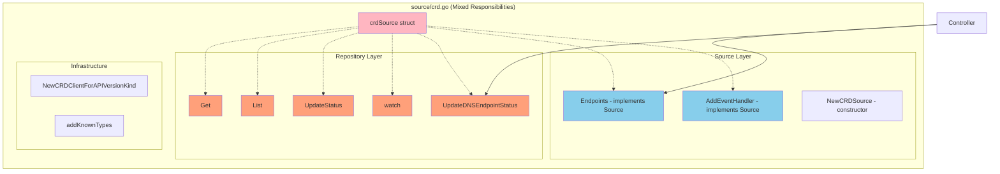
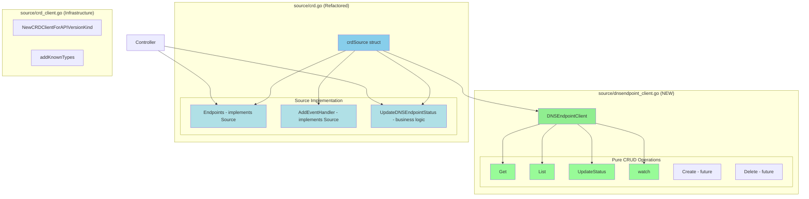
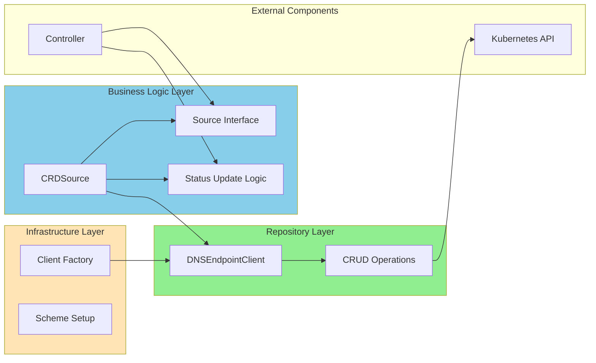
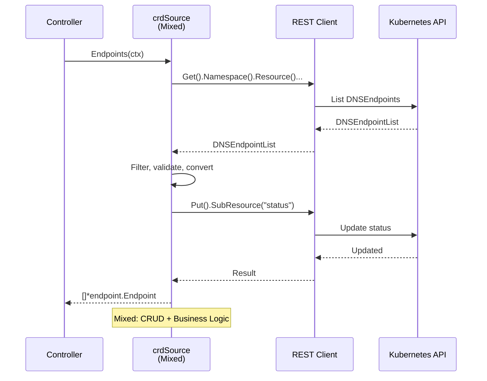
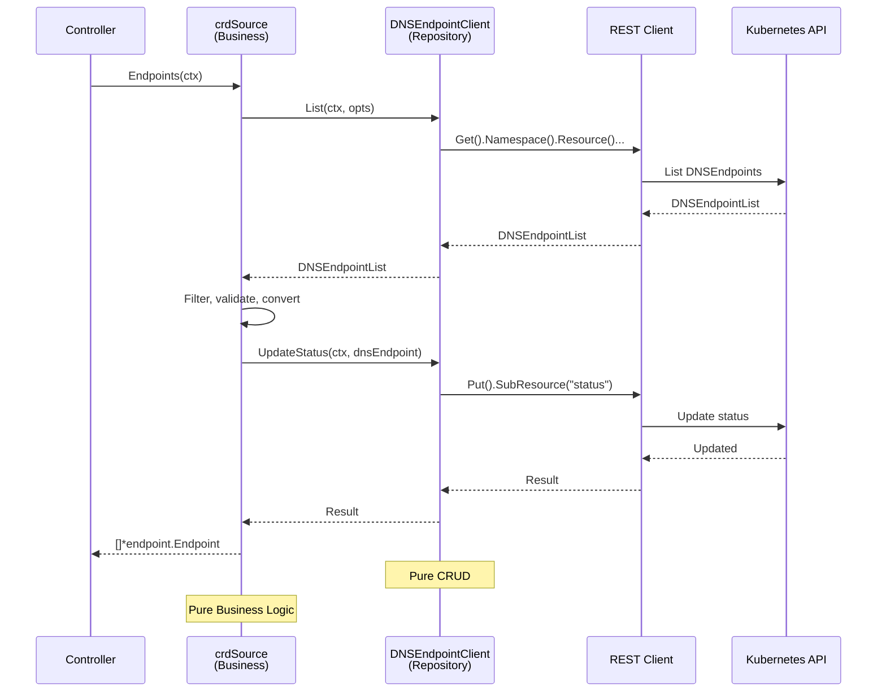
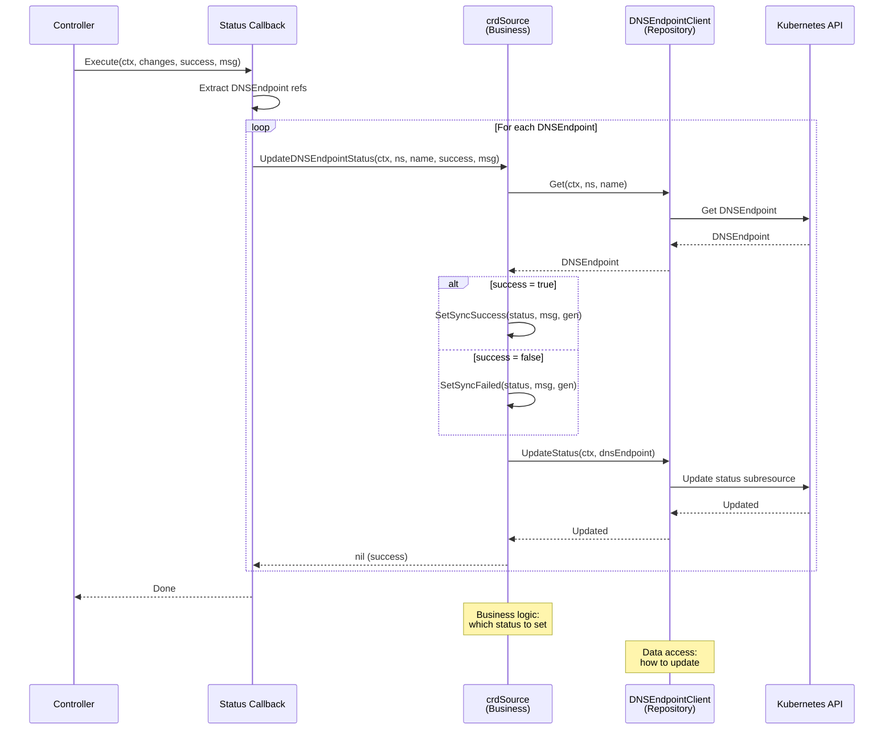
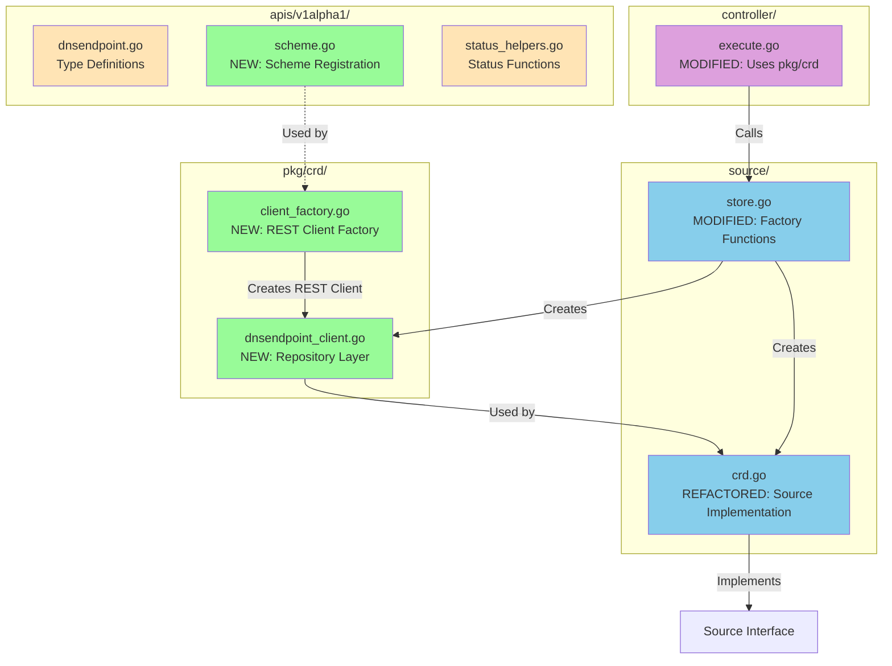

# CRD Source Refactoring Plan: Separation of Concerns

## Key Changes Summary

Based on architectural review, the following package locations have been chosen:

1. **`pkg/crd/`** - New package for reusable CRD client infrastructure
   - `dnsendpoint_client.go` - Repository layer (CRUD operations)
   - `client_factory.go` - REST client factory

2. **`apis/v1alpha1/`** - Type definitions and scheme registration
   - `scheme.go` - Scheme registration (moved from `source/crd.go`)
   - Should be auto-generated by `controller-gen` in the future

3. **`source/`** - Source implementation (business logic only)
   - `crd.go` - Refactored to use `crd.DNSEndpointClient` interface

This organization:
- ✅ Makes CRD client infrastructure reusable across packages
- ✅ Keeps type registration with type definitions
- ✅ Separates business logic from data access
- ✅ Enables future code generation

## Problem Statement

Currently, `source/crd.go` mixes two distinct responsibilities:

1. **CRD Client/Repository** - Low-level CRUD operations on DNSEndpoint CRDs
2. **Source Implementation** - Business logic for implementing the Source interface

This violates the Single Responsibility Principle and makes the code harder to:
- Test (can't test CRUD operations independently)
- Reuse (CRUD logic is locked inside Source)
- Maintain (changes to one concern affect the other)
- Extend (adding new CRD operations requires modifying Source)

## Current Architecture

### Current Structure Diagram



### Current Responsibilities

| Component | Responsibility | Layer |
|-----------|---------------|-------|
| `Get()` | Fetch single DNSEndpoint | Repository |
| `List()` | Fetch all DNSEndpoints | Repository |
| `UpdateStatus()` | Update DNSEndpoint status | Repository |
| `watch()` | Watch for CRD changes | Repository |
| `UpdateDNSEndpointStatus()` | Update status with business logic | Repository (but has business logic!) |
| `Endpoints()` | Convert CRDs to endpoints, filtering | Source/Business |
| `AddEventHandler()` | Register event handlers | Source/Business |
| `NewCRDSource()` | Initialize source with informer | Source/Business |
| `NewCRDClientForAPIVersionKind()` | Create REST client | Infrastructure |

## Proposed Architecture

### New Structure Diagram



### Component Separation



## Detailed File Structure

### 1. pkg/crd/dnsendpoint_client.go (NEW)

**Purpose**: Pure repository/data access layer for DNSEndpoint CRDs

**Location Rationale**:
- `pkg/crd/` is a shared package for CRD client infrastructure
- Can be used by `source/`, `controller/`, or any other package
- Not tied to Source implementation

**Responsibilities**:
- CRUD operations on DNSEndpoint resources
- Low-level Kubernetes API interactions
- No business logic
- No knowledge of Source interface

**Interface**:
```go
package crd

type DNSEndpointClient interface {
    // Get retrieves a single DNSEndpoint by namespace and name
    Get(ctx context.Context, namespace, name string) (*apiv1alpha1.DNSEndpoint, error)

    // List retrieves all DNSEndpoints matching the given options
    List(ctx context.Context, opts *metav1.ListOptions) (*apiv1alpha1.DNSEndpointList, error)

    // UpdateStatus updates the status subresource of a DNSEndpoint
    UpdateStatus(ctx context.Context, dnsEndpoint *apiv1alpha1.DNSEndpoint) (*apiv1alpha1.DNSEndpoint, error)

    // Watch returns a watch interface for DNSEndpoint changes
    Watch(ctx context.Context, opts *metav1.ListOptions) (watch.Interface, error)

    // Future: Create, Update, Delete operations if needed
}

type dnsEndpointClient struct {
    restClient  rest.Interface
    namespace   string
    resource    string
    codec       runtime.ParameterCodec
}

func NewDNSEndpointClient(restClient rest.Interface, namespace, kind string, codec runtime.ParameterCodec) DNSEndpointClient
```

**Methods**:
- `Get(ctx, namespace, name)` - Simple fetch
- `List(ctx, opts)` - List with options
- `UpdateStatus(ctx, dnsEndpoint)` - Update status subresource
- `Watch(ctx, opts)` - Watch for changes

### 2. source/crd.go (Refactored)

**Purpose**: Source implementation that uses DNSEndpointClient

**Responsibilities**:
- Implement Source interface (Endpoints, AddEventHandler)
- Business logic: filtering, validation, conversion
- Status update orchestration (uses client internally)
- Informer management

**Structure**:
```go
type crdSource struct {
    client           DNSEndpointClient
    annotationFilter string
    labelSelector    labels.Selector
    informer         cache.SharedInformer
}

func NewCRDSource(client DNSEndpointClient, ..., startInformer bool) (Source, error)

// Implements Source interface
func (cs *crdSource) Endpoints(ctx context.Context) ([]*endpoint.Endpoint, error)
func (cs *crdSource) AddEventHandler(ctx context.Context, handler func())

// Status update business logic
func (cs *crdSource) UpdateDNSEndpointStatus(ctx context.Context, namespace, name string, success bool, message string) error {
    // Uses cs.client.Get() and cs.client.UpdateStatus()
    // Contains business logic for setting status
}
```

**Key Changes**:
- Uses `DNSEndpointClient` interface instead of direct REST client
- Focuses on Source interface implementation
- Business logic for status updates (which status to set, when)

### 3. pkg/crd/client_factory.go (NEW - Infrastructure)

**Purpose**: Client factory and REST client setup

**Location Rationale**:
- `pkg/crd/` is shared infrastructure for CRD clients
- Can be reused for other CRD types in the future

**Content**:
- `NewCRDClientForAPIVersionKind()` - Creates REST client
- Client configuration logic
- REST client builder functions

### 4. apis/v1alpha1/scheme.go (NEW - Type Registration)

**Purpose**: Scheme registration for DNSEndpoint types

**Location Rationale**:
- `apis/v1alpha1` is where types are defined
- Scheme registration belongs with type definitions
- May be auto-generated in the future (e.g., via controller-gen)

**Content**:
```go
package v1alpha1

func AddToScheme(scheme *runtime.Scheme) error {
    scheme.AddKnownTypes(SchemeGroupVersion,
        &DNSEndpoint{},
        &DNSEndpointList{},
    )
    metav1.AddToGroupVersion(scheme, SchemeGroupVersion)
    return nil
}
```

**Future**: This could be generated by `controller-gen` or similar tools

### 5. source/crd.go (Refactored)

**Purpose**: Source implementation that uses DNSEndpointClient

**See detailed structure in "2. source/crd.go (Refactored)" section above**

### 6. source/store.go (Modified)

**Changes**: Updated to use new package locations

```go
import (
    // ... existing imports ...
    "sigs.k8s.io/external-dns/pkg/crd"  // NEW import
)

func buildCRDSource(ctx context.Context, p ClientGenerator, cfg *Config) (Source, error) {
    client, err := p.KubeClient()
    if err != nil {
        return nil, err
    }

    // Create REST client using infrastructure from pkg/crd
    restClient, scheme, err := crd.NewCRDClientForAPIVersionKind(
        client,
        cfg.KubeConfig,
        cfg.APIServerURL,
        cfg.CRDSourceAPIVersion,
        cfg.CRDSourceKind,
    )
    if err != nil {
        return nil, err
    }

    // Create DNSEndpointClient (repository layer) from pkg/crd
    dnsEndpointClient := crd.NewDNSEndpointClient(
        restClient,
        cfg.Namespace,
        cfg.CRDSourceKind,
        runtime.NewParameterCodec(scheme),
    )

    // Create crdSource (business layer) with the client
    return NewCRDSource(
        dnsEndpointClient,
        cfg.Namespace,
        cfg.CRDSourceKind,
        cfg.AnnotationFilter,
        cfg.LabelFilter,
        cfg.UpdateEvents,
    )
}

func BuildCRDSource(ctx context.Context, p ClientGenerator, cfg *Config) (Source, error) {
    return buildCRDSource(ctx, p, cfg)
}
```

## Sequence Diagrams

### Current Flow (Before Refactoring)



### Proposed Flow (After Refactoring)



### Status Update Flow (After Refactoring)



## Implementation Steps

### Phase 1: Create Infrastructure and Repository Layer

1. **Create `pkg/crd/` directory**
   - New package for CRD client infrastructure

2. **Create `pkg/crd/dnsendpoint_client.go`**
   - Define `DNSEndpointClient` interface
   - Implement `dnsEndpointClient` struct
   - Move CRUD methods from `source/crd.go`: `Get()`, `List()`, `UpdateStatus()`, `Watch()`
   - Add constructor `NewDNSEndpointClient()`

3. **Create `pkg/crd/client_factory.go`**
   - Move `NewCRDClientForAPIVersionKind()` from `source/crd.go`
   - Keep REST client factory and configuration logic

4. **Create `apis/v1alpha1/scheme.go`**
   - Move `addKnownTypes()` from `source/crd.go` (rename to `AddToScheme()`)
   - Add scheme registration for DNSEndpoint types
   - Document that this should be auto-generated in future

### Phase 2: Refactor crdSource

5. **Modify `source/crd.go`**
   - Change `crdSource` struct:
     - Remove `crdClient rest.Interface`
     - Remove `crdResource string`
     - Remove `codec runtime.ParameterCodec`
     - Add `client crd.DNSEndpointClient` (from pkg/crd)
   - Update `NewCRDSource()`:
     - Accept `crd.DNSEndpointClient` parameter
     - Remove REST client setup (now external)
     - Keep informer setup
   - Update `Endpoints()`:
     - Use `cs.client.List()` instead of direct REST calls
     - Use `cs.client.UpdateStatus()` for status updates
   - Update `UpdateDNSEndpointStatus()`:
     - Use `cs.client.Get()` and `cs.client.UpdateStatus()`
   - Remove methods that moved to pkg/crd:
     - `List()` - now in `pkg/crd/dnsendpoint_client.go`
     - `Get()` - now in `pkg/crd/dnsendpoint_client.go`
     - `UpdateStatus()` - now in `pkg/crd/dnsendpoint_client.go`
     - `watch()` - now in `pkg/crd/dnsendpoint_client.go`
     - `NewCRDClientForAPIVersionKind()` - now in `pkg/crd/client_factory.go`
     - `addKnownTypes()` - now in `apis/v1alpha1/scheme.go`

### Phase 3: Update Factory Functions

6. **Modify `source/store.go`**
   - Add import: `"sigs.k8s.io/external-dns/pkg/crd"`
   - Update `buildCRDSource()`:
     - Use `crd.NewCRDClientForAPIVersionKind()` from pkg/crd
     - Create `crd.DNSEndpointClient` wrapper
     - Pass client to `NewCRDSource()`
   - Update `BuildCRDSource()` (exported version)

### Phase 4: Testing

7. **Create tests**
   - Create `pkg/crd/dnsendpoint_client_test.go` for repository layer tests
   - Create `pkg/crd/client_factory_test.go` for factory tests
   - Create `apis/v1alpha1/scheme_test.go` for scheme tests
   - Update `source/crd_test.go` to use mock `crd.DNSEndpointClient`
   - Verify all existing tests still pass

### Phase 5: Update Controller Integration

8. **Verify `controller/execute.go`**
   - Add import: `"sigs.k8s.io/external-dns/pkg/crd"`
   - Ensure `registerStatusUpdateCallbacks()` still works
   - Type assertion should work with `crd.DNSEndpointClient` interface
   - Should be mostly transparent since external API doesn't change

## Benefits of This Refactoring

### 1. Single Responsibility Principle
- **DNSEndpointClient**: Only responsible for CRUD operations
- **crdSource**: Only responsible for Source interface and business logic

### 2. Testability
- Can test CRUD operations independently with mock K8s API
- Can test Source logic with mock DNSEndpointClient
- Easier to write focused unit tests

### 3. Reusability
- DNSEndpointClient can be used by other components
- Not locked into crdSource
- Example: Direct status updates from controller without going through Source

### 4. Maintainability
- Changes to API calls don't affect business logic
- Changes to business logic don't affect API calls
- Clear separation makes code easier to understand

### 5. Future Extensibility
- Easy to add new CRUD operations (Create, Delete, Patch)
- Easy to swap implementations (e.g., caching layer)
- Can add repository-level features (retry logic, batching)

## Migration Strategy

### Backward Compatibility

The refactoring maintains the same external API:
- `NewCRDSource()` signature can remain compatible (internal changes only)
- `Source` interface implementation unchanged
- `UpdateDNSEndpointStatus()` signature unchanged

### Testing Strategy

1. **Add tests for new components first**
   - Test DNSEndpointClient independently
   - Create mock implementations

2. **Refactor incrementally**
   - Move one method at a time
   - Run tests after each change

3. **Verify integration**
   - Run full test suite
   - Test with real Kubernetes cluster if available

## Updated File Structure Diagram



## Files to Create/Modify

### New Files

**Infrastructure Layer (pkg/crd/)**:
- `pkg/crd/dnsendpoint_client.go` - Repository layer (CRUD operations)
- `pkg/crd/dnsendpoint_client_test.go` - Repository tests
- `pkg/crd/client_factory.go` - REST client factory and configuration
- `pkg/crd/client_factory_test.go` - Factory tests

**Type Registration (apis/v1alpha1/)**:
- `apis/v1alpha1/scheme.go` - Scheme registration (moved from source/crd.go)
- `apis/v1alpha1/scheme_test.go` - Scheme tests

### Modified Files

**Source Layer**:
- `source/crd.go` - Refactored to use `crd.DNSEndpointClient` interface
  - Changes: Use client instead of direct REST calls, remove CRUD methods
- `source/crd_test.go` - Updated to use mock `crd.DNSEndpointClient`
- `source/store.go` - Updated factory methods to create client from `pkg/crd`
  - Changes: Import `pkg/crd`, use `crd.NewDNSEndpointClient()`

**Controller Layer** (minimal changes):
- `controller/execute.go` - Add `pkg/crd` import, verify type assertions work

### Code Movements

**From `source/crd.go` → `pkg/crd/dnsendpoint_client.go`**:
- `Get(ctx, namespace, name)` method
- `List(ctx, opts)` method
- `UpdateStatus(ctx, dnsEndpoint)` method
- `watch(ctx, opts)` method (renamed to `Watch` - exported)

**From `source/crd.go` → `pkg/crd/client_factory.go`**:
- `NewCRDClientForAPIVersionKind()` function

**From `source/crd.go` → `apis/v1alpha1/scheme.go`**:
- `addKnownTypes()` function (renamed to `AddToScheme()`)

### Removed Code

From `source/crd.go`:
- Direct REST client interactions in CRUD methods
- Low-level Kubernetes API call construction
- REST client and codec fields in struct
- Resource name field (moved to client layer)

## Risk Assessment

### Low Risk
- No external API changes
- Maintains backward compatibility
- Purely internal refactoring

### Mitigation
- Comprehensive test coverage before refactoring
- Incremental changes with testing at each step
- Keep old code commented during migration for reference

## Success Criteria

1. ✅ All existing tests pass
2. ✅ New DNSEndpointClient tests added and passing
3. ✅ Clear separation: Repository vs Business logic
4. ✅ No regression in functionality
5. ✅ Code is more maintainable and testable
6. ✅ Documentation updated
